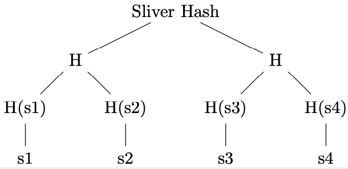
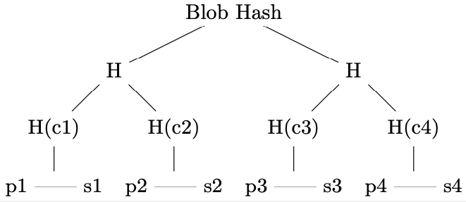

# The RedStuff Encoding Algorithm

The RedStuff encoding algorithm used in Walrus is an adaptation of the _Twin-Code framework_ presented by Rashmi et al. [^twincode].

## Goals & Overview

The goal of the Walrus system is to provide a distributed storage infrastructure, where a decentralized set of entities—the _storage
nodes_—collaborate to store and serve files ("blobs" of data). When it comes to storage properties, Walrus has a three key goals:

1. To support extremely high availability and durability of the data;
2. to have low storage overhead _compared to full replication_, i.e., we don't want to store each blob on every storage node;
3. to gracefully support node failures, and in particular to allow for _efficient node recovery_ (more on this later).

Given these requirements, one good option is to _erasure encode_ the blobs across the storage nodes. At a high level, erasure encoding (or erasure
coding) allows to encode the data into $N$ parts, such that the aggregate size of the $N$ blobs is a small multiple of the original blob size, and a
_subset_ $k$ of these parts is sufficient to recover the original blob. We formalize these concepts in the next section, but now note that erasure
coding already allows us to achieve goals (1) and (2) above, because:

1. Erasure coding allows to recover a blob even if $N - k$ storage nodes fail, providing high availability and durability to the data;
2. the overall storage overhead is much smaller than for full replication, as for a blob of size $S$, the total storage used in the system is
   $S \cdot c$ instead of $S \cdot N$, where $c \ll N$ is a small constant (4.5 in Walrus's case).

To achieve the third requirement, however, simple erasure coding is insufficient: A failed node that wants to reconstruct its part of the encoding
needs to first fetch at least $k$ other parts, reconstruct the blob, and then re-encode its own part. Therefore, the communication overhead for
recovery is on the order of the size of the whole blob, $S$. With RedStuff, we are instead capable of reconstructing the encoded part of a failed node
by fetching only $O(S/N)$ data, i.e., only in the order of the size of the lost part. Thus, we can achieve (3).

## Background

We provide here the essential background on the coding schemes used in RedStuff.

### Erasure Codes

Erasure coding considers the problem of error correction in the case of _bit erasures_, i.e., some bits in the message are lost, as in the case of a
lossy channel. In general, an erasure code divides a blob (or message) of $S$ bytes into $k$ _symbols_ (bitstrings of fixed length $~S/k$), which are
then encoded to form a longer message of $N$ symbols, such that the original blob can be recovered from any subset $k'$ of the $N$ symbols. $k/N$ is
called _code rate_.

### Fountain Codes

Fountain codes are a class of erasure codes. The key property of fountain codes is that the encoding process is _rateless_, i.e., the encoder can
produce an arbitrary number of encoded parts on the fly, without knowing the total number of parts that will be produced. This is useful for the
RedStuff use case, as it allows us to specify the rate of the encoder (e.g., by encoding $f+1$ source symbols into $N$ recovery symbols, we guarantee
that any subset of $f+1$ symbols can reconstruct the source). Further, fountain codes are extremely efficient as they typically require XOR operations
to encode and decode the data.

### RaptorQ

RedStuff is based on the RaptorQ fountain code. RaptorQ is one of the fastest and most efficient fountain codes, and has the following properties:

1. It is _systematic_, i.e., the first $k$ symbols of the encoded message correspond to the original message;
2. it is a _linear_ code, i.e., the encoding process is a linear transformation of the input symbols, or in other words, the encoded symbols are
   linear combinations of the input symbols;
3. it is _almost optimal_, meaning that the $k' ~ k$. Specifically, the probability of decoding failure for $k' = k + H$ symbols received is
   $< 1/256^{H+1}$

## RedStuff Encoding

An old idea in distributed storage is to use an erasure code to encode blobs of data across multiple storage nodes. Thus, by using $k/N$ rate erasure
code, for $N$ nodes and $k$ source symbols, the system can tolerate $N - k$ node failures, with just an $N/k$ factor of storage overhead. However, in
the case of a node failure, the recovery process is inefficient: the failed node needs to fetch $k$ other parts, reconstruct the blob, and then
re-encode its own part. Therefore, the communication overhead for recovery is on the order of the size of the whole blob, $S$.

The Twin-Code Framework aims to solve this issue by allowing for efficient node recovery. We briefly describe here how the framework is used in
RedStuff, and refer to the original paper for the specific details.  The RedStuff encoding algorithm is an adaptation of the Twin-Code framework,
which allows for efficient node recovery in erasure-coded storage systems.

We consider a scenario in which a blob of data is encoded and stored across $N$ _shards_—multiple shards can be mapped to the same storage node—in a
Byzantine setting. Thus, we assume that up to $f$ of the shards can be corrupted by an adversary, with $f < 1/3 N$, and that the remaining $N - f$
shards are honest.

### Encoding and Recovery

The RedStuff encoding and recovery process works as follows:

- First, in RedStuff, the data blob of size $S$ is divided into symbols and arranged in a rectangular _message matrix_, of up to $N - 2f$ rows and
  $N - f$ columns of symbols. The number of rows ($n_R$) and columns ($n_C$) is fixed, and determines the symbol size $s$ as follows:

$$
s = \left\lceil \frac{S}{n_R \cdot n_C } \right\rceil
$$

- Then, the columns and the rows of such message matrix are encoded separately with RaptorQ.
  - The _primary encoding_, performed on columns, expands the $n_R$ symbols of each column to $N$ symbols (as mentioned above, the rateless nature of
  RaptorQ allows us to choose the number of encoded symbols).
  - The _secondary encoding_, performed on rows, expands the $n_C$ symbols of each row to $N$ symbols.
- Thus, $n_R$ is also called the number of "primary source symbols", and $n_C$ the number of "secondary source symbols". Clearly, the primary encoding
  has rate $n_R / N$, and the secondary encoding has rate $n_C / N$.
- The encoded rows and columns are then used to obtain primary and secondary _slivers_, which are distributed to shards and used for blob
  reconstruction and sliver recovery:
  - Primary slivers are the rows of the matrix of size $N \times n_C$ obtained with the primary encoding of the message matrix. Each primary sliver is
    therefore composed of $n_C$ symbols.
  - Secondary slivers are the columns of the matrix of size $n_R \times N$ obtained with the primary encoding of the message matrix. Each secondary
    sliver is therefore composed of $n_R$ symbols.
- Each shard receives a primary and a secondary sliver, based on the shard number and the row and column numbers of the slivers (see the
  [section on sliver-to-shard mapping](#sliver-pair-to-shard-mapping) for more details).
- The fundamental property we achieve with this construction, and thanks to the linearity of RaptorQ, is that encoding the primary slivers (as rows)
  with the secondary encoding and the secondary slivers (as columns) with the primary encoding results in the same $N \times N$ expanded message
  matrix. This property can then be used for lost sliver recovery:
  - If a shard is trying reconstruct a lost primary sliver, it can request $N-f$ symbols from the encodings of the secondary slivers of other shards,
    because, as mentioned above, the primary encoding of secondary slivers results in the symbols for primary slivers. Then, since the secondary
    encoding has $n_C$ source symbols, and $n_C \leq N-2f$, we can decode the original primary sliver from the obtained recovery symbols with high
    probability (see the later [discussion on recovery probability](#decoding-probability-and-decoding-safety-limit)).
  - The reconstruction of secondary slivers is identical, but inverting the role of primary and secondary slivers and encodings.

The following example concretely shows this process in action.

### Worked Example

#### Encoding

Consider a Walrus instance with $N = 7 = 3f + 1$ shards. This entails that the number of primary source symbols is $N - 2f = 3$, and secondary
$N - f = 5$. A blob of size $S = 15 \cdot s$ can therefore be divided into 15 symbols of size $s$, and arranged in the matrix as follows.

$$
\left[
\begin{array}{ccccc}
s_{0,0} & s_{0,1} & s_{0,2} & s_{0,3} & s_{0,4} \\
s_{1,0} & s_{1,1} & s_{1,2} & s_{1,3} & s_{1,4} \\
s_{2,0} & s_{2,1} & s_{2,2} & s_{2,3} & s_{2,4} \\
\end{array}
\right]
$$

Then, the primary encoding acts on the columns of the matrix, expanding them such that each column is composed of 4 source symbols and 6 recovery
symbols ($s_{i,j}$ indicates source symbols, while $r_{i,j}$ indicates recovery symbols).

$$
\left[
\begin{array}{c|c|c|c|c}
s_{0,0} & s_{0,1} & s_{0,2} & s_{0,3} & s_{0,4} \\
s_{1,0} & s_{1,1} & s_{1,2} & s_{1,3} & s_{1,4} \\
s_{2,0} & s_{2,1} & s_{2,2} & s_{2,3} & s_{2,4} \\
\textcolor{blue}{r_{3,0}} & \textcolor{blue}{r_{3,1}} & \textcolor{blue}{r_{3,2}} & \textcolor{blue}{r_{3,3}} & \textcolor{blue}{r_{3,4}} \\
\textcolor{blue}{r_{4,0}} & \textcolor{blue}{r_{4,1}} & \textcolor{blue}{r_{4,2}} & \textcolor{blue}{r_{4,3}} & \textcolor{blue}{r_{4,4}} \\
\textcolor{blue}{r_{5,0}} & \textcolor{blue}{r_{5,1}} & \textcolor{blue}{r_{5,2}} & \textcolor{blue}{r_{5,3}} & \textcolor{blue}{r_{5,4}} \\
\textcolor{blue}{r_{6,0}} & \textcolor{blue}{r_{6,1}} & \textcolor{blue}{r_{6,2}} & \textcolor{blue}{r_{6,3}} & \textcolor{blue}{r_{6,4}} \\
\end{array}
\right]
$$

Each of the _rows_ of this column expansion is a _primary sliver_. E.g., $[r_{5,0}, r_{5,1}, r_{5,2}, r_{5,3}, r_{5,4}, r_{5,5}, r_{5,6}]$.

Similarly, the secondary encoding on the rows of the matrix produces the expanded rows.

$$
\left[
\begin{array}{ccccccc}
s_{0,0} & s_{0,1} & s_{0,2} & s_{0,3} & s_{0,4} & \textcolor{blue}{r_{0,5}} & \textcolor{blue}{r_{0,6}} \\
\hline
s_{1,0} & s_{1,1} & s_{1,2} & s_{1,3} & s_{1,4} & \textcolor{blue}{r_{1,5}} & \textcolor{blue}{r_{1,6}} \\
\hline
s_{2,0} & s_{2,1} & s_{2,2} & s_{2,3} & s_{2,4} & \textcolor{blue}{r_{2,5}} & \textcolor{blue}{r_{2,6}} \\
\end{array}
\right]
$$

Each of the _columns_ of this column expansion is a _secondary sliver_. E.g., $[r_{0,6}, r_{1,6}, r_{2,6}]$.

The $i$ th _sliver pair_ is composed of the $i$ th primary and $i$ th secondary slivers. For simplicity, consider that the $i$ th sliver pair is
stored on shard $i$ (we later discuss the mapping between sliver pairs and shards).

Thanks to the linearity of RaptorQ, the expansion of

- the recovery secondary slivers (columns 5,6) with the primary encoding; and
- the recovery primary slivers (rows 3,4,5,6) with the secondary encoding;

result in the same set of symbols, which is essential for recovery. Therefore, these symbols can be represented as the lower-right quadrant of what we
call the "fully expanded message matrix".

$$
\left[
\begin{array}{ccccc|cc}
% a matrix 7x7 as above, with the lower right 4x2 quadrant in bold
s_{0,0} & s_{0,1} & s_{0,2} & s_{0,3} & s_{0,4} & r_{0,5} & r_{0,6} \\
s_{1,0} & s_{1,1} & s_{1,2} & s_{1,3} & s_{1,4} & r_{1,5} & r_{1,6} \\
s_{2,0} & s_{2,1} & s_{2,2} & s_{2,3} & s_{2,4} & r_{2,5} & r_{2,6} \\
\hline
r_{3,0} & r_{3,1} & r_{3,2} & r_{3,3} & r_{3,4} & \textcolor{blue}{r_{3,5}} & \textcolor{blue}{r_{3,6}} \\
r_{4,0} & r_{4,1} & r_{4,2} & r_{4,3} & r_{4,4} & \textcolor{blue}{r_{4,5}} & \textcolor{blue}{r_{4,6}} \\
r_{5,0} & r_{5,1} & r_{5,2} & r_{5,3} & r_{5,4} & \textcolor{blue}{r_{5,5}} & \textcolor{blue}{r_{5,6}} \\
r_{6,0} & r_{6,1} & r_{6,2} & r_{6,3} & r_{6,4} & \textcolor{blue}{r_{6,5}} & \textcolor{blue}{r_{6,6}} \\
\end{array}
\right]
$$

Note again that these symbols do not need to be stored on any node because they can always be recomputed by expanding either a primary or secondary
symbol. E.g, $r_{4,5}$ can be obtained by:

- the secondary-encoding expansion of the 4th primary sliver: $[r_{4,0}, r_{4,1}, r_{4,2}, r_{4,3}, r_{4,4}, \textcolor{blue}{r_{4,5}}, r_{4,6}]$; or
- the primary-encoding expansion of the 5th secondary sliver: $[r_{0,5}, r_{1,5}, r_{2,5}, r_{3,5}, \textcolor{blue}{r_{4,5}}, r_{5,5}, r_{6,5}]$.

#### Recovery

Consider now that shard 3 fails, losing its slivers, and needs to recover them.
In the following, the symbols of the lost slivers are highlighted in red (recall that the lower quadrant is never stored).

$$
\left[
\begin{array}{ccccc|cc}
s_{0,0} & s_{0,1} & s_{0,2} & \textcolor{red}{s_{0,3}} & s_{0,4} & r_{0,5} & r_{0,6} \\
s_{1,0} & s_{1,1} & s_{1,2} & \textcolor{red}{s_{1,3}} & s_{1,4} & r_{1,5} & r_{1,6} \\
s_{2,0} & s_{2,1} & s_{2,2} & \textcolor{red}{s_{2,3}} & s_{2,4} & r_{2,5} & r_{2,6} \\
\hline
\textcolor{red}{r_{3,0}} & \textcolor{red}{r_{3,1}} & \textcolor{red}{r_{3,2}} & \textcolor{red}{r_{3,3}} & \textcolor{red}{r_{3,4}} & & \\
r_{4,0} & r_{4,1} & r_{4,2} & r_{4,3} & r_{4,4} & & \\
r_{5,0} & r_{5,1} & r_{5,2} & r_{5,3} & r_{5,4} & & \\
r_{6,0} & r_{6,1} & r_{6,2} & r_{6,3} & r_{6,4} & & \\
\end{array}
\right]
$$

To recover the primary sliver, the node needs to contact 5 other shards and request the recovery symbols for the 3rd primary slivers. Since the
symbols of the sliver are recovery symbols, the shards need to encode their secondary slivers (here highlighted as columns) to obtain them. For
example, shards 0, 1, 2, 4, 6 provide the symbols:

$$
\left[
\begin{array}{c|c|c|c|c|c|c}
s_{0,0} & s_{0,1} & s_{0,2} & \textcolor{red}{s_{0,3}} & s_{0,4} & r_{0,5} & r_{0,6} \\
s_{1,0} & s_{1,1} & s_{1,2} & \textcolor{red}{s_{1,3}} & s_{1,4} & r_{1,5} & r_{1,6} \\
s_{2,0} & s_{2,1} & s_{2,2} & \textcolor{red}{s_{2,3}} & s_{2,4} & r_{2,5} & r_{2,6} \\
\textcolor{green}{r_{3,0}} & \textcolor{green}{r_{3,1}} & \textcolor{green}{r_{3,2}} &  & \textcolor{green}{r_{3,4}} &  & \textcolor{green}{r_{3,6}}\\
\end{array}
\right]
$$

To recover the secondary sliver, the node needs to contact at 3 other shards to obtain recovery symbols. In this case however, the recovery symbols
are already part of the primary slivers (here highlighted as rows) stored by the other shards, so no re-encoding is necessary. For example, shards 0,
1, 5 provide the recovery symbols:

$$
\left[
\begin{array}{ccccc}
s_{0,0} & s_{0,1} & s_{0,2} & \textcolor{green}{s_{0,3}} & s_{0,4} \\
\hline
s_{1,0} & s_{1,1} & s_{1,2} & \textcolor{green}{s_{1,3}} & s_{1,4} \\
\hline
s_{2,0} & s_{2,1} & s_{2,2} & s_{2,3} & s_{2,4} \\
\hline
\textcolor{red}{r_{3,0}} & \textcolor{red}{r_{3,1}} & \textcolor{red}{r_{3,2}} & \textcolor{red}{r_{3,3}} & \textcolor{red}{r_{3,4}} \\
\hline
r_{4,0} & r_{4,1} & r_{4,2} & r_{4,3} & r_{4,4} \\
\hline
r_{5,0} & r_{5,1} & r_{5,2} & \textcolor{green}{r_{5,3}} & r_{5,4} \\
\hline
r_{6,0} & r_{6,1} & r_{6,2} & r_{6,3} & r_{6,4} \\
\end{array}
\right]
$$

Note that in this case, the symbols $s_{0,3}, s_{1,3}, s_{2,3}$ are already stored in the primary slivers of shards 0, 1, 2, directly. Therefore, by
asking these shards, shard 3 does not even need to decode the symbols to recover its secondary sliver.

### Properties and Observations

#### Why the Rectangular Layout?

The rectangular layout of the message matrix is an optimization for the Byzantine setting. When storing the blob, a client can only await $N - f$
responses, as the remaining $f$ shards can be Byzantine. Yet, $f$ of these $N-f$ may be the Byzantine ones, and the $f$ that did not reply were only
slow because of asynchrony in the network. Therefore, the blob needs to be encoded in such a way that $N-2f$ symbols are sufficient to recover the
original blob. This is achieved by the primary encoding.

However, after this initial sharing phase, the honest shards share and reconstruct the missing slivers from each other. At a steady state, therefore,
we can always assume that $N - f$ honest shards are in possession of their slivers. Thus, the secondary encoding can have a higher rate, $(N-f)/N$,
decreasing the storage overhead while maintaining the same fault tolerance properties.

#### Worst Case Initial Sharing

We explain here how the $N-f$ honest shards can obtain their sliver pairs in the worst case outlined above, i.e., when the client shares the slivers
with $N-f$ shards, $f$ of which are Byzantine (and, e.g., drop them).

1. The $N-2f$ honest shards receive the sliver pairs.
2. The remaining $f$ honest shards are notified of the stored blob (e.g., through the chain), and start the process to recover their sliver pairs.
3. First, they recover their _secondary slivers_, as they can be decoded from $N-2f$ recovery symbols.
4. Then, once all $N-f$ honest shards have their secondary slivers, they can start recovering the primary slivers (which indeed require $N-f$ recovery
   symbols).
5. All honest shards have their sliver pairs.

#### Storage Overhead

Assume for simplicity that $N=3f+1$. Then, the original blob is divided into roughly $f \cdot 2f = 2f^2$ symbols.
The system has to store $N \cdot 2f$ primary sliver symbols, and $N \cdot f$ secondary sliver symbols, for a total storage of about $9f^2$ symbols.

Therefore, the storage overhead due to RedStuff encoding is about $9f^2 / 2f^2 = 4.5$ times the original blob size.

#### Differences with the Twin-Code Framework

The key modifications in RedStuff, compared to the original Twin-Code framework, are the following:

- RedStuff uses the RaptorQ fountain code for both the "Type 0" and "Type 1" encoding, as they are called in the paper. The rates are about $(N-2f)/N$
  and $(N-f)/N$ respectively. We later discuss more in detail the exact rates and the decoding probability. We call the Type 0 encoding the _primary
  encoding_, and the Type 1 encoding the _secondary encoding_.
- The blob is not laid out in a square message matrix, but in a rectangular one. As we explain in the following, this is an optimization for the
  specific BFT setting we are considering.
- Both "Type 0" and "Type 1" encodings are stored on each shard. In our terminology these are called "slivers", and the two together form a "sliver
  pair".

## Walrus-specific Parameters and Considerations

### Sliver-Pair-to-Shard Mapping

So far we have assumed that sliver pair $i$ is stored on shard $i$. In practice, however, the sliver pairs are mapped to shards in a pseudo-random
fashion. This is to ensure that the _systematic_ slivers, i.e., the slivers that contain the original data, are not always stored on the same
shard.

This is important because we foresee that the systematic slivers will be the most frequently accessed, because they can be used to access the data
without any decoding.

In brief, the mapping is done as follows: each encoded blob is assigned a 32 byte pseudo random blob ID. This ID is interpreted as an unsigned
big-endian integer, and its reminder modulo $N$ is then used as a rotation offset, such that the sliver pair $i$ is stored on shard
$(i + \text{offset}) \mod N$.

### Decoding Probability and Decoding Safety Limit

As mentioned above, the reconstruction failure probability of the RaptorQ code is $O(256^{-(H+1)})$, where $H$ is the number of extra symbols
received.  Therefore, it is beneficial that in a system with $f$ Byzantine shards, the number of source symbols for the primary encoding is slightly
below $N-2f$, and for the secondary encoding slightly below $N-f$. This ensures that whenever a validity or quorum threshold of messages is received,
there is always a positive $H$ for a low failure probability.

We therefore set the following parameters in our encoding configuration:

- $f$, the maximum number of Byzantine shards is $\lfloor (N-1) / 3 \rfloor$.
- The _safety limit_ for the encoding, $\sigma$, to ensure high reconstruction probability, is set as a function of $N$ (see table below).
- The number of primary source symbols (equivalent to the number of symbols in a secondary sliver) is $N - 2f -\sigma$
- The number of secondary source symbols (equivalent to the number of symbols in a primary sliver) is $N - f -\sigma$

Currently, $\sigma$ is selected depending on the number of shards as follows:

| N shards from | N shards to (incl) | $\sigma$ | Prob. failure |
|--------------:|-------------------:|---------:|--------------:|
|             0 |                 15 |        0 |       0.00391 |
|            16 |                 30 |        1 |      1.53e-05 |
|            31 |                 45 |        2 |      5.96e-08 |
|            46 |                 60 |        3 |      2.33e-10 |
|            61 |                 75 |        4 |      9.09e-13 |
|            76 |                inf |        5 |      3.55e-15 |

For example, then, we have the following settings:

| N shards |   f | $\sigma$ | # primary | # secondary |
|---------:|----:|---------:|----------:|------------:|
|        7 |   2 |        0 |         3 |           5 |
|       10 |   3 |        0 |         4 |           7 |
|       31 |  10 |        2 |         9 |          19 |
|      100 |  33 |        5 |        29 |          62 |
|      300 |  99 |        5 |        97 |         196 |
|     1000 | 333 |        5 |       329 |         662 |

## Blob Size Limits

In RaptorQ, the size of a symbol is encoded as a 16-bit integer. Therefore, the maximum size of a blob that can be encoded is $2^{16} - 1 = 65535$
bytes. As a minimum, a symbol must be at least 1 byte.

Since the blob is encoded in the rectangular message matrix, the blob size is upperbound by `source_symbols_primary * source_symbols_secondary *
u16::MAX` and lowerbound by `source_symbols_primary * source_symbols_secondary`. A few examples for the same configurations as above:

| N shards | Min blob size | Max blob size | Min encoded blob size | Max encoded blob size |
|---------:|--------------:|--------------:|----------------------:|----------------------:|
|        7 |        15.0 B |        983 KB |                56.0 B |               3.67 MB |
|       10 |        28.0 B |       1.83 MB |                 110 B |               7.21 MB |
|       31 |         171 B |       11.2 MB |                 868 B |               56.9 MB |
|      100 |       1.80 KB |        118 MB |               9.10 KB |                596 MB |
|      300 |       19.0 KB |       1.25 GB |               87.9 KB |               5.76 GB |
|     1000 |        218 KB |       14.3 GB |                991 KB |               64.9 GB |

## Sliver Authentication, Blob Metadata, and the Blob ID

Alongside the efficient encoding performed by RedStuff, we want to enable shards to authenticate that the slivers and encoding symbols they receive
indeed belong to the blob they wanted. We briefly outline here how this is achieved.

For each sliver, primary or secondary, a Merkle tree is constructed.

Importantly, the tree is constructed over all the $N$ symbols of the _fully expanded sliver_.  The root node of the Merkle tree (the sliver hash) is
included in the metadata for the blob. Therefore, to prove that a symbol is part of a sliver, the prover supplies the symbol alongside the Merkle path
to the root hash, which every node has as part of the metadata.

Then, a Merkle tree over the sliver hashes is computed to obtain a blob hash. This is computed by concatenating primary and secondary sliver hashes
(computed as above) for each sliver pair, and then constructing the Merle tree over the concatenations ($c_i$ in the figure). This construction was
chosen to reduce the number of hashing operations compared to hashing each sliver Merkle root individually.

Therefore, to prove that a sliver is indeed part of a blob, it is sufficient to provide the Merkle path to the root.

Finally, the encoding type tag (representing the RedStuff version, or alternative encoding), the length of the blob _before_ the encoding, and the
Merkle root of the tree over the slivers are hashed together to obtain the _blob ID_.

### Metadata Overhead

As seen above, each storage node needs to store the full metadata for the blob.
The metadata consists of:

- A `32 B` Merkle root hash for each primary and secondary sliver;
- the `32 B` blob ID, computed as above;
- the erasure code type (`1 B`);
- the length of the unencoded blob size (`8 B`).

Of these, the hashes for the primary and secondary slivers can be a considerable overhead, if the number of shards is high. We show here the
cumulative size of the hashes stored on the system, depending on the number of nodes and the number of shards.

| N shards | One node | floor(N/floor(log2(N)) nodes | N nodes |
|---------:|---------:|-----------------------------:|--------:|
|        7 |    448 B |                      1.34 KB | 3.14 KB |
|       10 |    640 B |                      1.92 KB | 6.40 KB |
|       31 |  1.98 KB |                      13.9 KB | 61.5 KB |
|      100 |  6.40 KB |                       102 KB |  640 KB |
|      300 |  19.2 KB |                       710 KB | 5.76 MB |
|     1000 |  64.0 KB |                      7.10 MB | 64.0 MB |

We see that the cumulative size of the hashes in the case of 1000 nodes (1 node per shard), is 64KB per node, or 64MB for a system of 1000 nodes.
However, recall that the number of shards is set and constant, while the number of nodes may vary (each node has one or more shards), potentially
lowering the overhead on the system.  We therefore show here the ratio between the size of the hashes stored on the system to the minimum and maximum
blob sizes, for `N=1000` shards and different number of nodes (1 node, floor(N/floor(log2(N))) = 111, 1000).

| N = 1000                      | Total metadata size | Factor min blob | Factor max blob | Factor min encoded blob | Factor max encoded blob |
| ----------------------------- | ------------------: | --------------: | --------------: | ----------------------: | ----------------------: |
| Single node                   |             64.0 KB |           0.294 |        4.48e-06 |                  0.0646 |                9.85e-07 |
| floor(N/floor(log2(N))) nodes |             7.10 MB |            32.6 |        0.000498 |                    7.17 |                0.000109 |
| N nodes                       |             64.0 MB |             294 |         0.00448 |                    64.6 |                0.000985 |

We see that for realistic node counts and small blob sizes, the total metadata overhead goes can be multiple times the size of the initial unencoded
blob. However, for larger blob sizes, the overhead is negligible.

[^twincode]: K. V. Rashmi, N. B. Shah and P. V . Kumar, "Enabling node repair in any erasure code for distributed storage," 2011 IEEE International
    Symposium on Information Theory Proceedings, St. Petersburg, Russia, 2011, pp. 1235-1239, doi: 10.1109/ISIT.2011.6033732.
